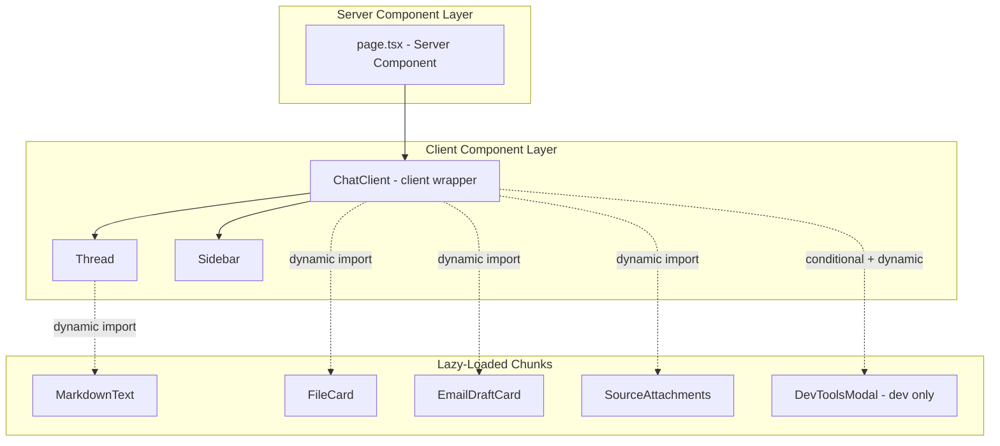

# Design Document: Performance Improvements

## Overview

The Harco Agent chat page currently transfers 2.7 MB / 12 MB of resources (cache disabled). The root causes are an unconditional DevTools import in production, a monolithic `"use client"` directive at the page level that bundles everything into one chunk, and missing tree-shaking configuration for barrel-exported libraries.

This design addresses bundle size reduction through eight coordinated changes: environment-gated DevTools, page-level code-splitting, lazy-loaded markdown rendering, dead code removal, Next.js `optimizePackageImports`, bundle analyzer tooling, `next/image` adoption, and UI library consolidation.

The changes are purely client-side build and bundling optimizations. No database, API, or backend changes are involved.

## Architecture



The key architectural change: `page.tsx` becomes a server component. A new `ChatClient` client component wraps the runtime provider and renders children. Heavy components load via `next/dynamic` only when needed.

## Components and Interfaces

### 1. `src/app/page.tsx` (Server Component)

Becomes a thin server component that renders the `ChatClient` wrapper. No `"use client"` directive.

```typescript
// src/app/page.tsx
import dynamic from "next/dynamic";

const ChatClient = dynamic(
  () => import("@/components/chat-client").then((m) => m.ChatClient),
  { ssr: false }
);

export default function ChatPage() {
  return <ChatClient />;
}
```

### 2. `src/components/chat-client.tsx` (Client Component)

New file. Contains the `"use client"` directive, runtime provider, state, and event handlers currently in `page.tsx`. Dynamically imports Tool UIs and conditionally loads DevToolsModal.

```typescript
"use client";

import { AssistantRuntimeProvider } from "@assistant-ui/react";
import { useChatRuntime } from "@assistant-ui/react-ai-sdk";
import dynamic from "next/dynamic";

// Tool UIs: only needed mid-conversation
const FileCard = dynamic(
  () => import("@/components/tool-ui/file-card").then((m) => m.FileCard),
  { ssr: false },
);
const EmailDraftCard = dynamic(
  () =>
    import("@/components/tool-ui/email-draft-card").then(
      (m) => m.EmailDraftCard,
    ),
  { ssr: false },
);
const SourceAttachmentsDataUI = dynamic(
  () =>
    import("@/components/tool-ui/source-attachments").then(
      (m) => m.SourceAttachmentsDataUI,
    ),
  { ssr: false },
);

// DevToolsModal: only in dev when explicitly opted in
const DevToolsModal =
  process.env.NODE_ENV === "development" &&
  process.env.NEXT_PUBLIC_SHOW_DEVTOOLSMODAL === "true"
    ? dynamic(() =>
        import("@assistant-ui/react-devtools").then((m) => m.DevToolsModal),
      )
    : () => null;
```

### 3. `src/components/assistant-ui/markdown-text.tsx` (Lazy-Loaded)

No code changes to the file itself. Instead, it gets dynamically imported from within `thread.tsx`:

```typescript
const MarkdownText = dynamic(
  () => import("@/components/assistant-ui/markdown-text").then(m => m.MarkdownText),
  { loading: () => <MarkdownSkeleton /> }
);
```

### 4. `next.config.ts` (Updated)

```typescript
import type { NextConfig } from "next";
import bundleAnalyzer from "@next/bundle-analyzer";

const withBundleAnalyzer = bundleAnalyzer({
  enabled: process.env.ANALYZE === "true",
});

const nextConfig: NextConfig = {
  experimental: {
    optimizePackageImports: [
      "lucide-react",
      "@assistant-ui/react",
      "radix-ui",
      "@base-ui/react",
    ],
  },
};

export default withBundleAnalyzer(nextConfig);
```

### 5. Public Asset Images

Any `` tags referencing `/public/` assets get replaced with `next/image`:

```tsx
import Image from "next/image";

<Image src="/file.svg" alt="File icon" width={24} height={24} />;
```

SVGs already inlined as React components (like `diamond.tsx`) remain unchanged.

### 6. UI Library Consolidation Document

A new `doc/ui-library-mapping.md` documents which library owns each primitive and identifies overlaps to consolidate.

## Data Models

No data model changes. This feature is entirely about build output and client-side bundle composition. No database tables, API contracts, or persistence formats are affected.

## Correctness Properties

_A property is a characteristic or behavior that should hold true across all valid executions of a system-essentially, a formal statement about what the system should do. Properties serve as the bridge between human-readable specifications and machine-verifiable correctness guarantees._

### Property 1: Production build excludes DevTools

_For any_ production build of the application (NODE_ENV=production), the client-side JavaScript output under `.next/static/` shall contain zero references to `@assistant-ui/react-devtools` module code.

**Validates: Requirements 1.4, 1.5**

## Error Handling

| Scenario                                      | Handling                                                                                            |
| --------------------------------------------- | --------------------------------------------------------------------------------------------------- |
| Tool UI chunk fails to load                   | `next/dynamic` error boundary renders inline error indicator; thread continues rendering            |
| Markdown chunk fails to load                  | Retry import once; if retry fails, show "Message rendering unavailable" text in place of markdown   |
| Bundle analyzer not installed                 | `ANALYZE=true` build falls back gracefully (Next.js ignores missing plugin if conditionally loaded) |
| `optimizePackageImports` causes build failure | Remove offending package from the list; verify build passes before committing                       |
| DevToolsModal env var misconfigured           | No DevToolsModal renders (safe default); no error thrown                                            |

## Testing Strategy

**Why property-based testing does not apply:** This feature consists of build configuration changes, code-splitting, dead code removal, and asset optimization. These are not functions with meaningful input variation. The outputs are build artifacts and runtime behavior that can only be verified through build checks, integration tests, and manual verification. There is no pure logic layer where randomized inputs would reveal bugs.

### Unit Tests (vitest)

- **DevToolsModal gating**: Mock `process.env` and verify the component renders or returns null based on `NODE_ENV` and `NEXT_PUBLIC_SHOW_DEVTOOLSMODAL` values.
- **ChatClient renders without SimpleImageAttachmentAdapter**: Verify `useChatRuntime` is called without an `attachments` adapter and the component mounts without errors.
- **MarkdownText lazy-load fallback**: Verify the loading skeleton renders while the chunk is pending.

### Build Verification Tests (CI script)

- **No devtools in production chunks**: After `npm run build`, grep `.next/static/` for `react-devtools` and assert zero matches.
- **Bundle size regression**: Capture baseline transferred KB after all optimizations; fail CI if size regresses beyond a threshold (e.g., 10%).
- **optimizePackageImports build success**: `npm run build` exits 0 with the config in place.
- **Bundle analyzer output**: `ANALYZE=true npm run build` exits 0 and produces `.next/analyze/` output.

### Manual Verification

- **Code-splitting**: Open Network tab, verify Tool UI chunks load only when a tool call renders.
- **Markdown lazy-load**: Verify `@assistant-ui/react-markdown` chunk loads only after first assistant message streams.
- **next/image**: Lighthouse audit shows no unoptimized images from `public/`.
- **UI library audit**: Bundle analyzer treemap shows no duplicate primitives across libraries.

### Test Configuration

- Test runner: vitest (already configured)
- Build verification: shell script in `scripts/verify-bundle.sh` run as part of CI
- No property-based tests for this feature (PBT not applicable)
