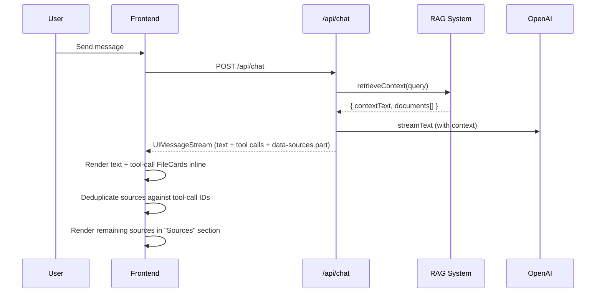

# Design: Proactive Attachments

## Overview

This feature automatically surfaces RAG source documents as downloadable FileCards below assistant responses, without requiring the LLM to explicitly call the `fileReference` tool for each one. The approach uses AI SDK's streaming custom data parts to attach source document metadata to the response stream, and a new frontend component to render them.

The core insight: the RAG system already knows which documents were used. Rather than depending on the LLM to reliably cite every source (costing extra tokens and adding latency), we attach the metadata deterministically at the API layer and let the frontend render it.

## Architecture



### Key Design Decision: Data Parts over Message Metadata

AI SDK v6 provides two mechanisms for attaching extra data:

- **Message metadata**: message-level info (timestamps, token usage). Sent via `messageMetadata` callback on `toUIMessageStreamResponse`.
- **Data parts**: streamed content that appears in `message.parts`. Sent via `createUIMessageStream` with `writer.write()`.

We use **data parts** because:

1. They integrate naturally with assistant-ui's `message.parts` rendering pipeline
2. They support the `makeAssistantDataUI` registration pattern already used for tool UIs
3. They persist in message history (important for scroll-back)
4. They appear as first-class parts alongside text and tool-call parts

## Components and Interfaces

### Backend: Chat Route Changes

The route switches from `result.toUIMessageStreamResponse()` to using `createUIMessageStream` + `createUIMessageStreamResponse`, which allows writing a custom data part before merging the LLM stream.

```typescript
// src/app/api/chat/route.ts (modified section)

import {
  createUIMessageStream,
  createUIMessageStreamResponse,
  streamText,
  convertToModelMessages,
} from "ai";

// Inside POST handler, after retrieveContext:
const stream = createUIMessageStream({
  execute: ({ writer }) => {
    // Write source documents as a data part (only if documents exist)
    if (contextDocs.length > 0) {
      writer.write({
        type: "data-sources",
        data: {
          documents: contextDocs.slice(0, 8), // Cap at 8
        },
      });
    }

    // Stream the LLM response
    const result = streamText({
      /* ...existing config... */
    });
    writer.merge(result.toUIMessageStream());
  },
});

return createUIMessageStreamResponse({ stream });
```

### Frontend: Source Attachments Component

A new component registered via `makeAssistantDataUI` that renders the "Sources" section.

```typescript
// src/components/tool-ui/source-attachments.tsx

import { makeAssistantDataUI } from "@assistant-ui/react";
import { FileCard } from "./file-card";

interface SourceDocument {
  id: string;
  title: string;
  file_type: string;
  file_size_bytes: number;
}

interface SourcesData {
  documents: SourceDocument[];
}
```

### Deduplication Logic

A pure utility function that computes which source documents to display after removing those already shown via `fileReference` tool calls.

```typescript
// src/lib/deduplicate-sources.ts

export function deduplicateSources(
  sourceDocuments: SourceDocument[],
  toolCallDocumentIds: string[],
): SourceDocument[] {
  const toolCallIdSet = new Set(
    toolCallDocumentIds.map((id) => id.toLowerCase()),
  );
  return sourceDocuments.filter(
    (doc) => !toolCallIdSet.has(doc.id.toLowerCase()),
  );
}
```

### Integration Point: Thread Component

The `AssistantMessage` component in `thread.tsx` already uses `MessagePrimitive.GroupedParts` which will automatically render the data part via the registered `makeAssistantDataUI`. The data part renders after text and tool-call parts by default (data parts appear at the end of the parts array in the stream order).

## Data Models

### Source Data Part Schema

```typescript
// Sent as part of the UIMessageStream
type SourcesDataPart = {
  type: "data-sources";
  data: {
    documents: Array<{
      id: string; // UUID from documents table
      title: string; // Document title
      file_type: string; // Extension: "docx", "pdf", "eml"
      file_size_bytes: number;
    }>;
  };
};
```

### Constraints

- Maximum 8 documents per annotation (matches RAG MATCH_COUNT)
- Documents are pre-deduplicated by the RAG system (unique by `document_id`)
- IDs are UUIDs from the `documents` table

## Correctness Properties

_A property is a characteristic or behavior that should hold true across all valid executions of a system -- essentially, a formal statement about what the system should do. Properties serve as the bridge between human-readable specifications and machine-verifiable correctness guarantees._

### Property 1: Annotation count equals unique document count

_For any_ array of retrieved documents (potentially containing duplicates by ID), the number of documents in the emitted source data part SHALL equal the number of unique document IDs in the input, up to a maximum of 8.

**Validates: Requirements 1.1, 1.4, 1.5**

### Property 2: Annotation data integrity

_For any_ context document with fields `id`, `title`, `file_type`, and `file_size_bytes`, the corresponding entry in the source data part SHALL contain all four fields with values identical to the input.

**Validates: Requirements 1.3**

### Property 3: Deduplication against tool calls

_For any_ set of source annotation document IDs and any set of `fileReference` tool-call document IDs, the rendered source attachments SHALL contain exactly those documents whose IDs (compared case-insensitively) appear in the annotation set but NOT in the tool-call set.

**Validates: Requirements 3.1, 3.2, 3.3**

### Property 4: Sources label conditional rendering

_For any_ assistant message, the "Sources" label SHALL be present if and only if the deduplicated source document list (after removing tool-call duplicates) is non-empty.

**Validates: Requirements 4.1, 4.2**

## Error Handling

| Scenario                                      | Handling                                                                                                               |
| --------------------------------------------- | ---------------------------------------------------------------------------------------------------------------------- |
| RAG returns empty documents array             | No `data-sources` part written to stream. Frontend renders nothing.                                                    |
| RAG throws an error                           | Existing behavior: `contextDocs` defaults to `[]`. No sources emitted. Chat continues without context.                 |
| Malformed data part received by frontend      | `makeAssistantDataUI` render function checks for valid `documents` array before rendering. Returns `null` if invalid.  |
| Document ID in annotation doesn't exist in DB | Download link still renders (existing FileCard behavior). The `/api/download` route returns 404 if document not found. |

## Testing Strategy

### Property-Based Tests (fast-check, vitest)

The deduplication logic and annotation-building logic are pure functions suitable for property-based testing.

- **Library**: fast-check (already in devDependencies)
- **Runner**: vitest (existing test setup)
- **Minimum iterations**: 100 per property

Tests to write:

1. `buildSourceAnnotation(docs)` produces correct count and data (Properties 1, 2)
2. `deduplicateSources(sources, toolCallIds)` produces correct set difference (Property 3)
3. Component renders label iff sources non-empty after deduplication (Property 4)

Each test tagged with: `Feature: proactive-attachments, Property {N}: {description}`

### Unit Tests (example-based)

- Chat route emits `data-sources` part when documents exist (integration-style, mocked RAG)
- Chat route does NOT emit `data-sources` when no documents (edge case)
- Source attachments component renders FileCards with correct props
- Source attachments component renders nothing when `documents` is empty
- FileCards display after text and tool-call content (DOM order)
- Existing `fileReference` tool UI continues to render inline

### Integration Tests

- Full round-trip: send message, verify response stream contains both text and data-sources part
- Verify existing `fileReference` tool behavior is preserved alongside proactive attachments
