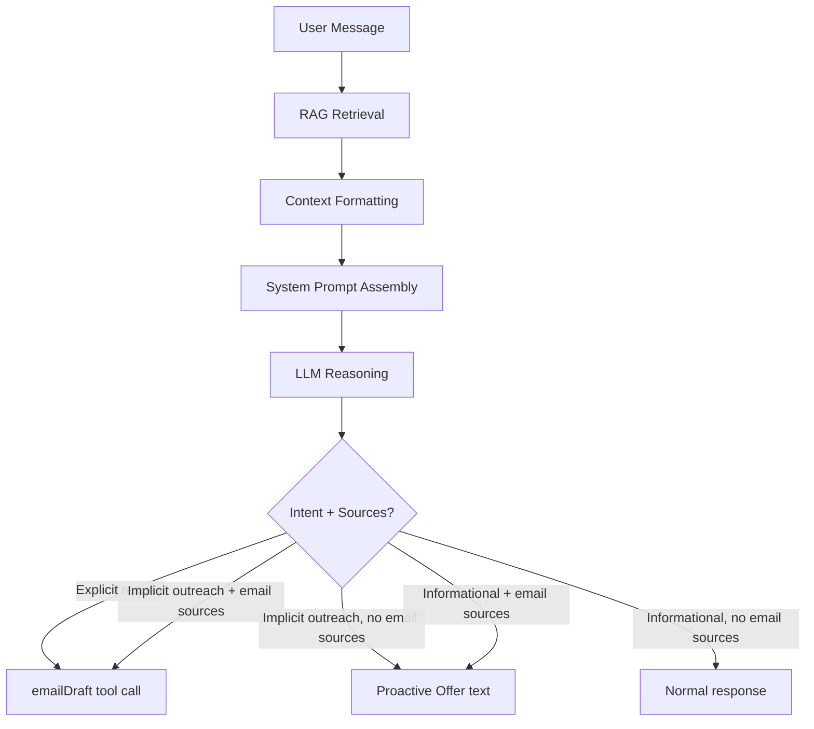

# Design Document: Proactive Email Drafting

## Overview

This feature modifies the Harco Agent's behavior so it proactively drafts or offers to draft emails when the conversation context suggests a salesperson needs one. The implementation is primarily prompt engineering: changes to the system prompt instruct the LLM how to classify user intent, detect email sources in RAG results, and decide when to call the existing `emailDraft` tool vs. when to offer.

The only code changes are:
1. Expanding the system prompt with decision logic for proactive email behavior
2. Enhancing the RAG context format so the LLM can distinguish email-sourced chunks from other document types
3. Updating the `emailDraft` tool description to reflect its broader usage beyond explicit requests

No new API endpoints, database tables, or UI components are needed. The `emailDraft` tool and its white-background card rendering already exist.

## Architecture



The architecture stays the same single-request flow: user message -> RAG -> LLM with tools -> streamed response. The LLM's system prompt now contains a decision matrix that maps (intent classification x email source presence) to one of three actions: draft, offer, or neither.

## Components and Interfaces

### 1. Context Formatting (code change in `route.ts`)

Currently, the "Available Documents" section lists all retrieved documents with id, title, file_type, and size. The change adds an explicit `[EMAIL SOURCE]` tag to documents with `file_type` of "eml" or "msg", making it trivially easy for the LLM to identify email-sourced content.

**Current format:**
```
- [uuid] "FW - HARCO ARV Riser Assembly Proposal" (eml, 45230 bytes)
```

**New format:**
```
- [uuid] "FW - HARCO ARV Riser Assembly Proposal" (eml, 45230 bytes) [EMAIL SOURCE]
```

Additionally, the "Retrieved Context" section will prefix each chunk with its source document's file_type so the LLM can trace which chunks came from emails vs. other documents.

**Interface change to `retrieveContext` return type:**

```typescript
interface RetrievalResult {
  contextText: string;
  documents: SourceDocument[];
}
```

No change to the interface. The `contextText` formatting changes happen in `route.ts` where the system prompt is assembled. The `SourceDocument` type already contains `file_type`.

### 2. System Prompt Changes (`src/lib/system-prompt.ts`)

The system prompt gains three new sections:

1. **Email Source Detection** - Instructions for recognizing `[EMAIL SOURCE]` tags in the document list
2. **Intent Classification Rules** - Decision criteria for explicit request, implicit outreach, and informational queries
3. **Proactive Email Behavior Matrix** - The 2x3 decision table mapping (intent x email sources) to actions
4. **Email Draft Style Guide** - Instructions for adapting tone, using email sources as templates, leaving "to" empty, and omitting signatures

### 3. emailDraft Tool Description Update

Current description says "Use this when the user asks you to write or draft an email." This gets broadened to cover proactive drafting scenarios.

**New description:**
```
Generate an email draft that the user can open in Outlook. Use this when:
- The user explicitly asks for an email draft
- You detect implicit outreach intent AND email sources are in context
- The user accepts a proactive offer to draft an email
Do not include signature lines or placeholder fields in the body.
Leave "to" as empty string unless the user provides a specific recipient.
```

### 4. Email Source Helper Function

A small utility extracted from `route.ts` to classify documents:

```typescript
export function classifyEmailSources(docs: SourceDocument[]): {
  emailSources: SourceDocument[];
  otherSources: SourceDocument[];
} {
  const EMAIL_TYPES = new Set(["eml", "msg"]);
  return {
    emailSources: docs.filter((d) => EMAIL_TYPES.has(d.file_type)),
    otherSources: docs.filter((d) => !EMAIL_TYPES.has(d.file_type)),
  };
}
```

This function already exists implicitly (the `EMAIL_TYPES` set and filter in `route.ts`). Extracting it makes it testable and reusable for both the document list formatting and the attachment filtering.

### 5. Context Assembly with Email Source Annotations

The system prompt assembly in `route.ts` changes from a flat document list to one with explicit email source tagging:

```typescript
const { emailSources, otherSources } = classifyEmailSources(contextDocs);

const systemWithContext = `${SYSTEM_PROMPT}

## Available Documents for Reference
${contextDocs.map((d) => {
  const tag = EMAIL_TYPES.has(d.file_type) ? " [EMAIL SOURCE]" : "";
  return `- [${d.id}] "${d.title}" (${d.file_type}, ${d.file_size_bytes} bytes)${tag}`;
}).join("\n")}

## Email Sources Present: ${emailSources.length > 0 ? "YES" : "NO"}

## Retrieved Context
${contextText || "No relevant context found for this query."}`;
```

The `## Email Sources Present: YES/NO` line gives the LLM a quick signal without requiring it to scan the document list.

## Data Models

No database changes. The existing `documents` table already stores `file_type` for all ingested documents. The RAG RPC (`match_document_chunks`) already returns `document_file_type` per chunk.

The only data structure change is the extracted helper function's return type, defined in the Components section above.

## Correctness Properties

*A property is a characteristic or behavior that should hold true across all valid executions of a system -- essentially, a formal statement about what the system should do. Properties serve as the bridge between human-readable specifications and machine-verifiable correctness guarantees.*

### Property 1: Email source classification partitions correctly by file_type

*For any* set of SourceDocuments with arbitrary file_type values, `classifyEmailSources` SHALL return `emailSources` containing exactly those documents with file_type "eml" or "msg", and `otherSources` containing all remaining documents, with no documents lost or duplicated (emailSources.length + otherSources.length === input.length).

**Validates: Requirements 1.1, 1.3, 1.4**

### Property 2: Context formatting includes complete metadata for all email sources

*For any* set of SourceDocuments where at least one has file_type "eml" or "msg", the formatted document list string SHALL contain the document's id, title, and file_type for every email source document, and each email source line SHALL contain the "[EMAIL SOURCE]" tag while non-email documents SHALL NOT contain that tag.

**Validates: Requirements 1.2, 1.5**

## Error Handling

This feature has minimal error surface since it's prompt-driven:

1. **RAG returns no documents** - The system prompt instructs the LLM to skip proactive behavior when no email sources are present. The `## Email Sources Present: NO` signal ensures the LLM won't hallucinate email context.

2. **LLM fails to follow decision matrix** - This is a prompt engineering risk, not a runtime error. Mitigation: clear, unambiguous instructions with explicit YES/NO signals. Testing via integration tests with representative scenarios.

3. **emailDraft tool called with invalid parameters** - The Zod schema already validates the tool call. If the LLM passes malformed data, the tool call fails and the AI SDK surfaces it. No additional handling needed.

4. **Context window pressure** - Adding prompt instructions increases token usage. The new sections add ~400 tokens to the system prompt. With GPT-4o-mini's 128k context window and the current ~8 chunks of RAG context, this is negligible.

## Testing Strategy

### Why PBT Has Limited Scope Here

This feature is primarily prompt engineering. The LLM's decision-making (intent classification, tone adaptation, offer behavior) cannot be validated with property-based tests since there's no deterministic function to test. However, the **context formatting and email source classification** logic IS pure-function code that benefits from PBT.

### Property-Based Tests (fast-check, vitest)

- **Property 1**: Generate random arrays of SourceDocuments with mixed file_types. Verify `classifyEmailSources` always partitions correctly.
- **Property 2**: Generate random SourceDocuments, format the document list, verify email sources have the `[EMAIL SOURCE]` tag and non-email sources don't.

Configuration: minimum 100 iterations per property. Tag format: `Feature: proactive-email-drafting, Property {N}: {description}`.

### Unit Tests (vitest)

- Verify the `## Email Sources Present: YES` line appears when email sources exist
- Verify the `## Email Sources Present: NO` line appears when no email sources exist
- Verify the updated `emailDraft` tool description text
- Verify context assembly integrates new format correctly with empty document lists

### Integration Tests (manual / future automated)

Since most requirements validate LLM behavior, these need integration testing:

- Explicit email request with email sources in context -> emailDraft tool called
- Implicit outreach with email sources -> emailDraft tool called
- Implicit outreach without email sources -> proactive offer in text
- Informational query with email sources -> proactive offer in text
- Informational query without email sources -> no offer, no draft
- User declines offer -> no re-offer on same topic
- Affirmative response to offer -> emailDraft tool called
- Email draft has empty "to" field when no recipient specified
- Email draft omits signature/placeholder fields

These are best validated by running the app and testing with representative queries against the real RAG index.
