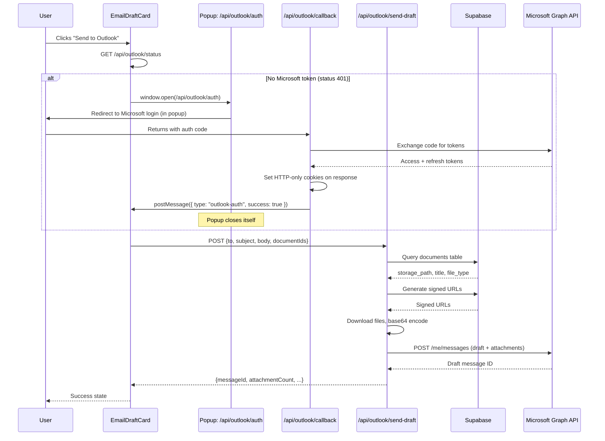

# Design Document: Send to Outlook

## Overview

This feature adds a "Send to Outlook" button to the EmailDraftCard component that creates a draft email in the user's Microsoft 365 mailbox via the Microsoft Graph API, including file attachments resolved from Supabase Storage. It replaces the limitations of mailto: links (no attachment support) with a server-mediated flow that keeps tokens and file content secure.

The flow: user clicks button → OAuth if needed → client POSTs to `/api/outlook/send-draft` → server resolves attachments from Supabase → server creates draft via Graph API → client shows success/error.

## Architecture



### Key Architectural Decisions

1. **Server-side token storage via HTTP-only cookies**: Keeps Microsoft tokens inaccessible to client JS. Aligns with the existing Supabase auth cookie pattern in `src/lib/supabase/server.ts`.

2. **Single API route for draft creation**: Rather than splitting into separate "resolve attachments" and "create draft" endpoints, one POST to `/api/outlook/send-draft` handles the entire flow. This minimizes round trips and keeps the client simple.

3. **Client passes document IDs, not file content**: The client already has access to document IDs from tool call args and source data. The server resolves them to actual file bytes, keeping binary content off the wire between client and server.

4. **No persistent token storage in DB**: Tokens live in cookies only. If cookies expire, the user re-authenticates. This avoids adding a new table and keeps the security surface small.

5. **Graceful degradation on attachment failures**: If some attachments fail (missing documents, download errors), the draft is still created with whatever attachments succeeded. The response reports what was skipped.

## Components and Interfaces

### Client Components

#### `OutlookButton` (new, in `src/components/tool-ui/outlook-button.tsx`)

A self-contained button component rendered inside EmailDraftCard's footer. Manages its own state machine (idle → loading → success/partial/error → idle).

```typescript
interface OutlookButtonProps {
  to: string;
  subject: string;
  body: string;
  documentIds: string[];
}

type ButtonState =
  | { status: "idle" }
  | { status: "loading" }
  | { status: "success" }
  | { status: "partial"; attached: number; total: number }
  | { status: "error"; message: string };
```

The component:
- Checks `outlookEnabled` prop (derived from a server-rendered flag based on env var presence) to decide whether to render at all.
- On click, checks for Microsoft auth by calling `GET /api/outlook/status` (returns 200 if tokens present, 401 if not).
- If no tokens, opens a **popup window** via `window.open("/api/outlook/auth", "outlook-auth", "width=600,height=700")`.
- Listens for a `postMessage` from the popup (type `"outlook-auth"`) indicating auth completed.
- After auth completes (or popup closes), re-checks `/api/outlook/status` and proceeds to send the draft.
- Resets to idle after 3s (success/partial) or 5s (error).

#### Modified `EmailDraftCard`

Add `documentIds?: string[]` and `outlookEnabled?: boolean` props. Render `OutlookButton` to the left of "Draft an Email" when `outlookEnabled` is true.

#### Modified `EmailDraftToolUI` (in `chat-client.tsx`)

Pass document IDs collected from sibling fileReference tool calls and source data attachments in the same message to the `EmailDraftCard`.

### Server Routes

#### `GET /api/outlook/auth` (new)

Constructs the Microsoft OAuth authorization URL and redirects the user (intended to run inside a popup window opened by `OutlookButton`).

```typescript
// No query params required (state is hardcoded to "popup")
// Redirects to: https://login.microsoftonline.com/common/oauth2/v2.0/authorize
//   with client_id, redirect_uri, scope=Mail.ReadWrite offline_access, response_type=code, state="popup"
// Returns 500 JSON error if MICROSOFT_CLIENT_ID or MICROSOFT_REDIRECT_URI are missing
```

#### `GET /api/outlook/callback` (new)

Handles the OAuth callback from Microsoft. Returns an HTML page that posts a message to the opener window and closes itself (popup-based flow).

```typescript
// Receives: ?code=<auth_code> (or ?error=<error_type> on denial)
// Exchanges code for tokens via POST to Microsoft token endpoint (10s timeout)
// Sets encrypted tokens in HTTP-only cookies on the response
// Returns HTML that calls: window.opener.postMessage({ type: "outlook-auth", success, error }, origin)
// Then closes the popup via window.close()
// Error cases: consent_denied, missing_code, not_configured, exchange_failed, timeout
```

#### `GET /api/outlook/status` (new)

Returns whether the user has valid Microsoft tokens.

```typescript
// Returns 200 { authenticated: true } if ms_access_token cookie exists
// Returns 401 { authenticated: false } if no token
```

#### `POST /api/outlook/send-draft` (new)

Creates the Outlook draft with attachments.

```typescript
interface SendDraftRequest {
  to: string;        // Valid email address
  subject: string;   // Max 255 chars
  body: string;      // HTML string, max 100,000 chars
  documentIds: string[]; // UUIDs, max 20 items
}

interface SendDraftResponse {
  messageId: string;
  attachmentCount: number;
  totalRequested: number;
  skippedDocumentIds: string[];
}
```

### Server Library

#### `src/lib/outlook/graph-client.ts` (new)

```typescript
interface GraphClientConfig {
  accessToken: string;
}

// Creates a draft message in the user's Outlook drafts folder
function createDraftMessage(config: GraphClientConfig, draft: {
  to: string;
  subject: string;
  bodyHtml: string;
}): Promise<{ id: string }>;

// Attaches a file to an existing draft message
function attachFile(config: GraphClientConfig, messageId: string, attachment: {
  filename: string;
  contentBytes: string; // base64
  contentType: string;
}): Promise<void>;

// Creates an upload session for files > 3MB
function createUploadSession(config: GraphClientConfig, messageId: string, attachment: {
  filename: string;
  fileSize: number;
}): Promise<{ uploadUrl: string }>;
```

#### `src/lib/outlook/token-manager.ts` (new)

```typescript
// Reads Microsoft tokens from HTTP-only cookies
function getTokens(cookieStore: ReadonlyRequestCookies): { accessToken: string; refreshToken: string } | null;

// Sets Microsoft tokens into HTTP-only cookies
function setTokens(response: NextResponse, tokens: { accessToken: string; refreshToken: string; expiresIn: number }): void;

// Clears Microsoft token cookies
function clearTokens(response: NextResponse): void;

// Refreshes an expired access token using the refresh token
function refreshAccessToken(refreshToken: string): Promise<{ accessToken: string; refreshToken: string; expiresIn: number }>;
```

#### `src/lib/outlook/attachment-resolver.ts` (new)

```typescript
interface ResolvedAttachment {
  documentId: string;
  filename: string;
  contentType: string;
  contentBytes: string; // base64-encoded
  sizeBytes: number;
}

interface AttachmentResolutionResult {
  resolved: ResolvedAttachment[];
  skipped: string[]; // document IDs that failed
}

// Deduplicates document IDs and resolves them to downloadable attachments
function resolveAttachments(documentIds: string[]): Promise<AttachmentResolutionResult>;

// Pure function: deduplicates an array of document IDs
function deduplicateDocumentIds(ids: string[]): string[];

// Pure function: constructs filename from document metadata
function buildFilename(title: string, fileType: string): string;
```

## Data Models

### Existing (no changes)

**documents table** (Supabase):
| Column | Type | Description |
|--------|------|-------------|
| id | uuid | Primary key |
| storage_path | text | Path in Supabase Storage bucket |
| title | text | Document display name |
| file_type | text | Extension (pdf, doc, etc.) |
| file_size_bytes | integer | File size |

### New: Cookie Schema

| Cookie Name | Value | Attributes |
|-------------|-------|------------|
| `ms_access_token` | Encrypted access token | HttpOnly, Secure, SameSite=Strict, Path=/, Max-Age=3600 |
| `ms_refresh_token` | Encrypted refresh token | HttpOnly, Secure, SameSite=Strict, Path=/, Max-Age=604800 (7 days) |
| `ms_token_expiry` | Unix timestamp (seconds) | HttpOnly, Secure, SameSite=Strict, Path=/ |

Tokens are encrypted at rest using AES-256-GCM with a key derived from `MICROSOFT_CLIENT_SECRET` before being stored in cookies. This prevents token leakage if cookies are somehow intercepted.

### New: Environment Variables

| Variable | Description | Required |
|----------|-------------|----------|
| `MICROSOFT_CLIENT_ID` | Azure AD app registration client ID | Yes |
| `MICROSOFT_CLIENT_SECRET` | Azure AD app registration client secret | Yes |
| `MICROSOFT_REDIRECT_URI` | OAuth callback URL (e.g., `https://app.example.com/api/outlook/callback`) | Yes |

### Request/Response Types

```typescript
// POST /api/outlook/send-draft request validation (using Zod)
const sendDraftSchema = z.object({
  to: z.string().email(),
  subject: z.string().max(255),
  body: z.string().max(100_000),
  documentIds: z.array(z.string().uuid()).max(20),
});
```

## Correctness Properties

*A property is a characteristic or behavior that should hold true across all valid executions of a system -- essentially, a formal statement about what the system should do. Properties serve as the bridge between human-readable specifications and machine-verifiable correctness guarantees.*

### Property 1: Attachment deduplication produces the unique union

*For any* two lists of document IDs (from fileReference tool calls and from source documents), the deduplicated result should contain each unique document ID exactly once, and should equal the set union of both input lists.

**Validates: Requirements 3.3, 3.4, 3.5**

### Property 2: Attachment filename construction

*For any* document with a non-empty title and a non-empty file_type, the constructed attachment filename should equal the title concatenated with a dot and the file_type (e.g., `"Product Spec" + "." + "pdf"` → `"Product Spec.pdf"`).

**Validates: Requirements 4.3**

### Property 3: Request validation rejects invalid inputs

*For any* request body where at least one field violates the schema (invalid email format, subject exceeding 255 characters, body exceeding 100,000 characters, documentIds exceeding 20 items, or documentIds containing non-UUID strings), the validation function should reject the input and identify the specific failing field.

**Validates: Requirements 6.3, 6.4**

### Property 4: Graceful degradation on attachment failures

*For any* set of document IDs where a subset fails resolution (not found in DB, signed URL failure, or download failure), the result should contain all successfully resolved documents and report the failed IDs as skipped, without the failures affecting the successful attachments.

**Validates: Requirements 3.8, 4.4, 4.5**

### Property 5: Partial success count accuracy

*For any* draft creation result where totalRequested > 0 and attachmentCount <= totalRequested, the partial success display should show the correct ratio of successful attachments to total requested.

**Validates: Requirements 5.4**

### Property 6: Draft payload preserves all email fields

*For any* valid email draft (to as valid email, subject as string ≤ 255 chars, body as string ≤ 100K chars), the constructed Microsoft Graph API payload should contain the exact to address in the toRecipients array, the exact subject string, and the body content with contentType set to "HTML".

**Validates: Requirements 3.2**

## Error Handling

| Scenario | Behavior | User Impact |
|----------|----------|-------------|
| Microsoft env vars missing | Button not rendered | User sees only mailto and copy buttons |
| OAuth popup blocked | Error state on button | Message: "Please allow popups for this site" |
| OAuth denied by user | Popup posts error, closes | Message: "Microsoft permissions not granted" |
| Token exchange fails | Popup posts error, closes | Message: "Microsoft permissions not granted" |
| Token exchange timeout | Popup posts error, closes | Message: "Microsoft permissions not granted" |
| Access token expired, refresh succeeds | Transparent retry | No user impact |
| Refresh token expired/revoked | 401 from API, triggers re-auth popup | User prompted to sign in again |
| Document not found in DB | Skipped, draft still created | Partial success with count |
| Signed URL generation fails | Skipped, draft still created | Partial success with count |
| File download from Supabase fails | Skipped, draft still created | Partial success with count |
| File > 3MB upload session fails | Skipped, draft still created | Partial success with count |
| Graph API returns 4xx/5xx | 502 from our endpoint | Error state: "Could not create draft" |
| Network timeout to Graph API | 502 from our endpoint | Error state: "Could not create draft" |
| Request body validation fails | 400 from our endpoint | Error state with specific field |

All errors are surfaced in the button's state machine and auto-reset (5s for errors, 3s for success/partial). No silent failures.

## Testing Strategy

### Unit Tests (vitest)

- **EmailDraftCard rendering**: Verify button placement, conditional rendering when `outlookEnabled` is false.
- **OutlookButton state machine**: Test all state transitions (idle → loading → success/partial/error → idle) with mocked fetch.
- **Token manager**: Test cookie read/write, encryption/decryption round-trip, expiry detection.
- **OAuth URL construction**: Verify correct scope, redirect_uri, state parameter.
- **Graph client payload construction**: Verify draft message shape matches Graph API expectations.
- **Attachment resolver edge cases**: Empty document list, all documents missing, mixed success/failure.

### Property-Based Tests (fast-check, already in devDependencies)

Each property test runs a minimum of 100 iterations.

- **Property 1** (deduplication): Generate random arrays of UUID-like strings with controlled overlap. Tag: `Feature: send-to-outlook, Property 1: Attachment deduplication produces the unique union`
- **Property 2** (filename): Generate random title/fileType pairs including edge cases (spaces, special chars, multi-dot extensions). Tag: `Feature: send-to-outlook, Property 2: Attachment filename construction`
- **Property 3** (validation): Generate invalid payloads via fast-check arbitraries that violate each constraint. Tag: `Feature: send-to-outlook, Property 3: Request validation rejects invalid inputs`
- **Property 4** (graceful degradation): Generate sets of document IDs with a random failure mask. Tag: `Feature: send-to-outlook, Property 4: Graceful degradation on attachment failures`
- **Property 5** (partial success count): Generate random (attached, total) pairs. Tag: `Feature: send-to-outlook, Property 5: Partial success count accuracy`
- **Property 6** (payload preservation): Generate random valid email drafts with unicode, HTML entities, long strings. Tag: `Feature: send-to-outlook, Property 6: Draft payload preserves all email fields`

### Integration Tests

- **OAuth callback route**: Mock Microsoft token endpoint, verify cookie setting.
- **Send-draft route**: Mock Supabase + Graph API, verify end-to-end flow including auth check, validation, attachment resolution, and Graph API call.
- **Token refresh flow**: Mock expired token scenario, verify transparent refresh.

### Manual Testing

- Full OAuth flow with a real Microsoft 365 account.
- Verify draft appears in Outlook with correct content and attachments.
- Test with files > 3MB to verify upload session path.
- Verify button doesn't render when env vars are missing (staging without Microsoft config).
