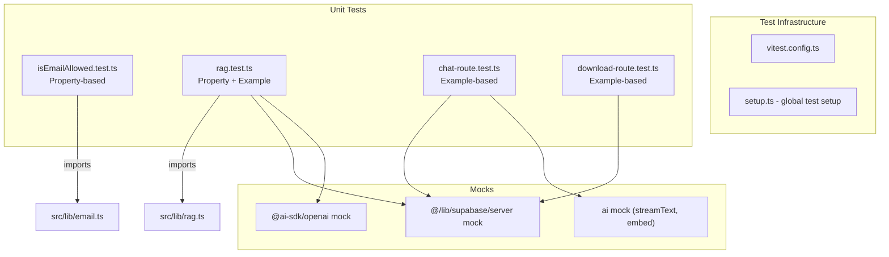

# Design Document: Test Suite

## Overview

This design establishes a Vitest-based unit testing infrastructure for the harco-agent project. The primary focus is testing pure business logic (email gating, RAG result shaping) with property-based tests, and API route guards with example-based tests using mocked Supabase and AI SDK dependencies.

The approach extracts `isEmailAllowed` into a standalone utility module for direct importability, mocks external services at the module boundary, and uses `fast-check` for property-based testing of the email gating and RAG shaping logic.

## Architecture



## Components and Interfaces

### Extracted Module: `src/lib/email.ts`

The `isEmailAllowed` function currently lives inside the login page component. It will be extracted to a pure utility module with no dependencies on React or Supabase, making it directly importable in tests.

```typescript
// src/lib/email.ts
const ALLOWED_DOMAIN = "harcofittings.com";

export function isEmailAllowed(email: string): boolean {
  const allowedEmails = (process.env.NEXT_PUBLIC_ALLOWED_EMAILS || "")
    .split(",")
    .map((e) => e.trim().toLowerCase())
    .filter(Boolean);

  const lower = email.toLowerCase();
  const domain = lower.split("@")[1];

  return domain === ALLOWED_DOMAIN || allowedEmails.includes(lower);
}
```

The login page then imports from this module:

```typescript
import { isEmailAllowed } from "@/lib/email";
```

### Vitest Configuration: `vitest.config.ts`

```typescript
import { defineConfig } from "vitest/config";
import path from "path";

export default defineConfig({
  test: {
    environment: "node",
    include: ["src/**/*.test.ts", "src/**/*.test.tsx"],
    globals: false,
  },
  resolve: {
    alias: {
      "@": path.resolve(__dirname, "./src"),
    },
  },
});
```

### Mocking Strategy

**Supabase server client** (`@/lib/supabase/server`): Mocked via `vi.mock()` at the module level. Each test configures the mock's return values for `auth.getUser()`, `rpc()`, `.from().select().eq().single()`, and `storage.from().createSignedUrl()`.

**AI SDK** (`ai`, `@ai-sdk/openai`): Mocked via `vi.mock()`. The `embed` function returns a fixed embedding vector. `streamText` returns a mock stream response. These are never called in property tests for RAG shaping because we mock at the Supabase RPC level and test the shaping logic directly.

**Environment variables**: Set via `vi.stubEnv()` or direct `process.env` assignment in test setup/teardown.

### Test File Organization

```
src/
├── lib/
│   ├── email.ts              (extracted from login page)
│   ├── email.test.ts         (property-based tests)
│   ├── rag.ts                (existing)
│   └── rag.test.ts           (property + example tests)
└── app/
    └── api/
        ├── chat/
        │   ├── route.ts
        │   └── route.test.ts (example-based tests)
        └── download/
            ├── route.ts
            └── route.test.ts (example-based tests)
```

## Data Models

### Chunk (from Supabase RPC response)

```typescript
interface Chunk {
  content: string;
  document_id: string;
  document_title: string;
  document_file_type: string;
  document_file_size_bytes: number;
  similarity: number;
}
```

### RetrievedDocument (output of retrieveContext)

```typescript
interface RetrievedDocument {
  id: string; // mapped from chunk.document_id
  title: string; // mapped from chunk.document_title
  file_type: string; // mapped from chunk.document_file_type
  file_size_bytes: number; // mapped from chunk.document_file_size_bytes
}
```

### RetrievalResult (output of retrieveContext)

```typescript
interface RetrievalResult {
  contextText: string; // chunks.content joined by "\n\n---\n\n"
  documents: RetrievedDocument[]; // deduplicated by document_id
}
```

## Correctness Properties

_A property is a characteristic or behavior that should hold true across all valid executions of a system, essentially a formal statement about what the system should do. Properties serve as the bridge between human-readable specifications and machine-verifiable correctness guarantees._

### Property 1: Allowed domain acceptance is case-insensitive

_For any_ string composed of valid email local-part characters followed by `@` and any casing of `harcofittings.com`, `isEmailAllowed` SHALL return `true`.

**Validates: Requirements 2.1, 2.4**

### Property 2: Non-allowed emails are rejected

_For any_ email string whose lowercased domain is not `harcofittings.com` and whose lowercased value is not in the allowlist, `isEmailAllowed` SHALL return `false`. This includes strings without an `@` character.

**Validates: Requirements 2.2, 2.5, 2.6**

### Property 3: Allowlist override accepts regardless of domain

_For any_ email string that appears in the `NEXT_PUBLIC_ALLOWED_EMAILS` environment variable (after trimming whitespace and lowercasing), `isEmailAllowed` SHALL return `true` regardless of the email's domain.

**Validates: Requirements 2.3**

### Property 4: Document deduplication by ID

_For any_ array of chunks where multiple chunks share a `document_id`, the `documents` output array SHALL contain exactly one entry per unique `document_id`, with field values from the first chunk encountered for that ID.

**Validates: Requirements 3.1**

### Property 5: Context text concatenation

_For any_ non-empty array of chunks, `contextText` SHALL equal the chunks' `content` fields joined in order by the separator `"\n\n---\n\n"`.

**Validates: Requirements 3.2**

### Property 6: Document field mapping correctness

_For any_ chunk in the input array, if its `document_id` is unique (first occurrence), the corresponding entry in `documents` SHALL have `id === chunk.document_id`, `title === chunk.document_title`, `file_type === chunk.document_file_type`, and `file_size_bytes === chunk.document_file_size_bytes`.

**Validates: Requirements 3.4**

## Error Handling

### Test Environment Errors

- Missing environment variables: Tests that depend on `NEXT_PUBLIC_ALLOWED_EMAILS` explicitly set/clear it in `beforeEach`/`afterEach`. No reliance on the developer's `.env.local`.
- Mock misconfiguration: Each test file resets mocks via `vi.resetAllMocks()` in `beforeEach` to prevent state leakage between tests.

### Production Code Error Paths Tested

- `retrieveContext` returns empty results on RPC error (verified via example test with mocked error)
- Chat route returns 401 on auth failure before parsing body (verified via mock that would throw if body were read)
- Download route returns 404/500 on DB/storage errors (verified via mocked failure responses)

## Testing Strategy

### Framework and Libraries

- **Vitest** (`vitest`): Test runner, assertion library, mocking
- **fast-check** (`fast-check`): Property-based testing library for generating random inputs
- Minimum **100 iterations** per property test (fast-check default is 100, no override needed)

### Test Types

| Test File                | Type                     | What It Tests                                                              |
| ------------------------ | ------------------------ | -------------------------------------------------------------------------- |
| `email.test.ts`          | Property-based           | `isEmailAllowed` domain logic, allowlist, rejection                        |
| `rag.test.ts`            | Property-based + Example | Deduplication, concatenation, field mapping, empty/error cases             |
| `chat/route.test.ts`     | Example-based            | Auth guard (401), happy path invokes streaming                             |
| `download/route.test.ts` | Example-based            | Auth (401), validation (400), not found (404), redirect (307), error (500) |

### Property-Based Test Configuration

Each property test uses `fast-check` with the `fc.assert(fc.property(...))` pattern:

```typescript
import fc from "fast-check";

it("Property 1: allowed domain acceptance", () => {
  // Feature: test-suite, Property 1: Allowed domain acceptance is case-insensitive
  fc.assert(
    fc.property(fc.emailAddress(), (localPart) => {
      // ... test body
    }),
  );
});
```

Tag format: `Feature: test-suite, Property {number}: {property_text}`

### Mocking Approach

1. **Module-level mocks** via `vi.mock("@/lib/supabase/server")` at the top of each test file
2. **Per-test configuration** of mock return values using `vi.mocked(createClient).mockResolvedValue(...)`
3. **No network calls**: All Supabase and OpenAI interactions are mocked
4. **Environment variables**: Managed with `vi.stubEnv()` for isolation between tests

### Package Installation

```bash
npm install -D vitest fast-check @types/node
```

Add to `package.json`:

```json
{
  "scripts": {
    "test": "vitest run"
  }
}
```
