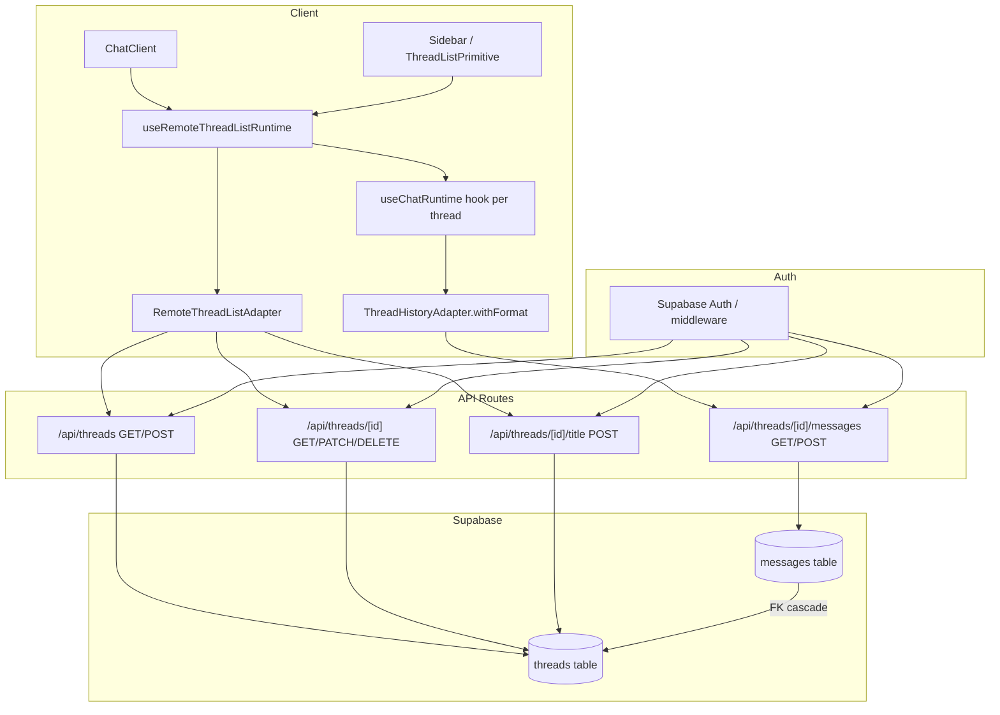

# Design Document: Thread History

## Overview

This design adds persistent multi-thread chat history to the Harco Agent app. The current single in-memory `useChatRuntime` is replaced by `useRemoteThreadListRuntime` backed by Supabase tables and API routes. Users get a sidebar showing past conversations grouped by date, with full CRUD operations (rename, archive, delete) and auto-generated titles.

The architecture follows the assistant-ui custom adapter pattern exactly: a `RemoteThreadListAdapter` manages thread metadata via REST routes, while a `ThreadHistoryAdapter.withFormat` handles message serialization using the `ai-sdk/v6` format. Both adapters talk to Next.js API routes that use the existing Supabase server client with RLS enforcement.

## Architecture



### Key Design Decisions

1. **REST routes over direct Supabase client calls from the browser.** Even though the browser client could query Supabase directly via RLS, routing through Next.js API routes keeps the adapter decoupled from Supabase specifics, allows server-side validation (title length), and enables auto-title generation with the AI model server-side.

2. **`archived_at` timestamp instead of a `status` enum.** The requirements spec uses `archived_at` (nullable timestamptz) rather than the assistant-ui docs' `status` enum. The adapter maps `archived_at !== null` to `status: "archived"` and `null` to `status: "regular"` when communicating with the runtime.

3. **Thread ID as text (UUID cast to text).** assistant-ui expects `remoteId` as a string. Using `gen_random_uuid()::text` as the default gives us globally unique IDs that work directly as route params without type coercion.

4. **Auto-title via a dedicated route.** The `generateTitle` adapter method calls `POST /api/threads/[id]/title`, which uses the same OpenAI model to produce a short title from the first exchange. This keeps the title-generation prompt server-side and avoids exposing it to the client.

## Components and Interfaces

### Database Layer

**Migration file:** `supabase/migrations/<timestamp>_create_thread_tables.sql`

Creates both tables, RLS policies, and indexes in a single migration.

### API Routes

| Route                        | Method | Purpose                            |
| ---------------------------- | ------ | ---------------------------------- |
| `/api/threads`               | GET    | List non-archived threads for user |
| `/api/threads`               | POST   | Create new thread                  |
| `/api/threads/[id]`          | GET    | Fetch single thread                |
| `/api/threads/[id]`          | PATCH  | Update title or archived_at        |
| `/api/threads/[id]`          | DELETE | Delete thread + messages           |
| `/api/threads/[id]/messages` | GET    | List messages for thread           |
| `/api/threads/[id]/messages` | POST   | Append message to thread           |
| `/api/threads/[id]/title`    | POST   | Generate title from first exchange |

Each route uses `createClient()` from `@/lib/supabase/server` for auth-scoped queries. Ownership is enforced by filtering on `user_id = auth.uid()` (via RLS) and returning 404 for missing/unowned resources.

### Client Adapter

**File:** `src/lib/thread-adapter.ts`

```typescript
// Exports
export const threadListAdapter: RemoteThreadListAdapter;
```

The adapter implements:

- `list()` - GET /api/threads, maps rows to `{ remoteId, title, status }`
- `initialize()` - POST /api/threads, returns `{ remoteId }`
- `rename(remoteId, title)` - PATCH with `{ title }`
- `archive(remoteId)` - PATCH with `{ archived_at: new Date().toISOString() }`
- `unarchive(remoteId)` - PATCH with `{ archived_at: null }`
- `delete(remoteId)` - DELETE
- `generateTitle(remoteId, messages)` - POST /api/threads/[id]/title
- `unstable_Provider` - injects `ThreadHistoryAdapter.withFormat` for message persistence

### Runtime Provider

**File:** `src/components/chat-client.tsx` (modified)

Replaces `useChatRuntime()` with:

```typescript
const runtime = useRemoteThreadListRuntime({
  runtimeHook: () => useChatRuntime(),
  adapter: threadListAdapter,
});
```

`SimpleImageAttachmentAdapter` remains registered via the `useChatRuntime` options.

### Sidebar Component

**File:** `src/components/app-shell/sidebar.tsx` (rewritten)

Uses `ThreadListPrimitive.Root`, `ThreadListPrimitive.Items`, and `ThreadListItemPrimitive` from assistant-ui. Adds date-grouping logic as a thin wrapper that classifies threads by `updated_at` into "Today", "Earlier this week", and "Earlier".

### Thread Item Component

**File:** `src/components/app-shell/thread-item.tsx` (new)

Individual thread row with:

- Title display (or truncated first-message preview at 50 chars)
- Active state highlighting via `data-active` attribute
- Context menu or icon buttons for rename/archive/delete
- Inline rename editing with validation

### Utility Functions

**File:** `src/lib/thread-utils.ts` (new)

Pure helper functions:

- `classifyDateGroup(updatedAt: Date): "today" | "earlier-this-week" | "earlier"` - Groups threads by local timezone
- `truncatePreview(text: string, max?: number): string` - Truncates to 50 chars with ellipsis
- `validateTitle(title: string): { valid: boolean; error?: string }` - Non-empty, max 100 chars, trimmed

## Data Models

### threads table

| Column      | Type        | Constraints                           |
| ----------- | ----------- | ------------------------------------- |
| id          | text        | PK, default `gen_random_uuid()::text` |
| user_id     | uuid        | NOT NULL, FK to auth.users            |
| title       | text        | nullable                              |
| archived_at | timestamptz | nullable                              |
| created_at  | timestamptz | NOT NULL, default now()               |
| updated_at  | timestamptz | NOT NULL, default now()               |

Indexes: `threads_user_id_idx` on `(user_id)`

### messages table

| Column     | Type        | Constraints                                   |
| ---------- | ----------- | --------------------------------------------- |
| id         | text        | PK                                            |
| thread_id  | text        | NOT NULL, FK to threads(id) ON DELETE CASCADE |
| parent_id  | text        | nullable                                      |
| format     | text        | NOT NULL                                      |
| content    | jsonb       | NOT NULL                                      |
| created_at | timestamptz | NOT NULL, default now()                       |

Indexes: `messages_thread_id_idx` on `(thread_id)`

### RLS Policies

**threads:**

- SELECT: `auth.uid() = user_id`
- INSERT: `auth.uid() = user_id`
- UPDATE: `auth.uid() = user_id`
- DELETE: `auth.uid() = user_id`

**messages:**

- SELECT: `thread_id IN (SELECT id FROM threads WHERE user_id = auth.uid())`
- INSERT: `thread_id IN (SELECT id FROM threads WHERE user_id = auth.uid())`

### API Request/Response Shapes

**Thread object (API response):**

```typescript
interface ThreadRow {
  id: string;
  title: string | null;
  archived_at: string | null;
  created_at: string;
  updated_at: string;
}
```

**Message row (stored in DB, served by API):**

```typescript
interface MessageRow {
  id: string;
  thread_id: string;
  parent_id: string | null;
  format: string; // e.g. "ai-sdk/v6"
  content: object; // opaque to server, decoded by withFormat on client
  created_at: string;
}
```

**POST /api/threads/[id]/messages request body:**

```typescript
interface CreateMessageBody {
  id: string;
  parent_id: string | null;
  format: string;
  content: object;
}
```

**POST /api/threads/[id]/title response:**

```typescript
interface GenerateTitleResponse {
  title: string; // 2-60 chars
}
```

## Correctness Properties

_A property is a characteristic or behavior that should hold true across all valid executions of a system -- essentially, a formal statement about what the system should do. Properties serve as the bridge between human-readable specifications and machine-verifiable correctness guarantees._

### Property 1: Thread list returns only non-archived threads in descending update order

_For any_ set of threads belonging to a user (with varying `archived_at` and `updated_at` values), the GET /api/threads endpoint SHALL return only threads where `archived_at` is null, and the returned array SHALL be sorted by `updated_at` descending.

**Validates: Requirements 2.1**

### Property 2: Title validation enforces trim and length constraint

_For any_ string input provided as a thread title, the validation logic SHALL trim leading/trailing whitespace and reject the result if it is empty or exceeds 100 characters. Valid titles (1-100 chars after trim) SHALL be accepted and stored in trimmed form.

**Validates: Requirements 2.3, 2.9, 8.2, 8.3**

### Property 3: Ownership authorization returns 404 for non-owners

_For any_ thread owned by user A and any request from user B (where B != A), all thread and message endpoints SHALL return a 404 response, never exposing the existence of the resource.

**Validates: Requirements 2.7, 3.3**

### Property 4: Messages are returned in chronological order

_For any_ set of messages in a thread (with varying `created_at` timestamps), the GET messages endpoint SHALL return them sorted by `created_at` ascending.

**Validates: Requirements 3.1**

### Property 5: Message body validation rejects incomplete payloads

_For any_ POST request body missing one or more required fields (`id`, `parent_id`, `format`, `content`) or containing a non-object `content` value, the messages endpoint SHALL return a 400 response.

**Validates: Requirements 3.4**

### Property 6: Message content round-trip preservation

_For any_ valid message with an arbitrary JSON object as `content`, posting the message via the messages POST endpoint and then retrieving it via the messages GET endpoint SHALL return the identical `content` value (deep equality).

**Validates: Requirements 3.6**

### Property 7: Adapter error propagation

_For any_ HTTP error status code (400-599) returned by a thread or message endpoint, the RemoteThreadListAdapter SHALL throw an error containing that status code.

**Validates: Requirements 4.8**

### Property 8: Date group classification

_For any_ timestamp value, the `classifyDateGroup` function SHALL return "today" if the timestamp is after midnight local time today, "earlier-this-week" if it is after the most recent Monday at midnight but before today, and "earlier" for all other timestamps.

**Validates: Requirements 6.2**

### Property 9: Thread item display text truncation

_For any_ string longer than 50 characters, the `truncatePreview` function SHALL return a string of exactly 50 characters including a trailing ellipsis character. For strings of 50 characters or fewer, it SHALL return the original string unchanged.

**Validates: Requirements 6.3**

### Property 10: Generated title length constraint

_For any_ successfully generated title, the value SHALL be between 2 and 60 characters in length (inclusive).

**Validates: Requirements 9.1**

## Error Handling

| Scenario                                            | Behavior                                                        |
| --------------------------------------------------- | --------------------------------------------------------------- |
| Unauthenticated request to any thread/message route | 401 response                                                    |
| Request for thread/message not owned by user        | 404 response (not 403, to avoid leaking existence)              |
| Title PATCH with >100 chars                         | 400 with error message                                          |
| Message POST with missing required fields           | 400 with field-level error message                              |
| Adapter receives non-2xx response                   | Throws error with status code; runtime surfaces to UI           |
| Thread list fails to load within 10s                | Error state in UI with retry button                             |
| Thread creation fails                               | Toast/error message; stays on current thread; preserves input   |
| Rename/archive/delete fails                         | Revert optimistic UI update; show error indication              |
| Title generation fails                              | Leave title null; sidebar continues showing message preview     |
| Network timeout on message append                   | Message stays in local state; adapter retries or surfaces error |

## Testing Strategy

### Property-Based Tests (fast-check)

The project already has `fast-check` installed. Each correctness property maps to a single property-based test with minimum 100 iterations.

**Library:** fast-check (already in devDependencies)
**Runner:** vitest
**Tag format:** `Feature: thread-history, Property {N}: {description}`

Properties 1-6 and 8-9 test pure logic functions or API route handlers with mocked Supabase clients. Property 7 tests the adapter with mocked fetch. Property 10 validates the title generation output constraint.

**Test files:**

- `src/app/api/threads/route.test.ts` - Properties 1, 2, 3 (thread routes)
- `src/app/api/threads/[id]/messages/route.test.ts` - Properties 4, 5, 6 (message routes)
- `src/lib/thread-adapter.test.ts` - Property 7 (adapter error handling)
- `src/lib/thread-utils.test.ts` - Properties 8, 9 (pure utility functions)
- `src/app/api/threads/[id]/title/route.test.ts` - Property 10 (title generation)

### Unit Tests (example-based)

For specific scenarios not covered by property tests:

- Thread creation returns correct response shape
- Archive/unarchive toggle behavior
- Sidebar empty state rendering
- Active thread highlighting
- Mobile sidebar close on new thread
- Escape key cancels rename
- Delete confirmation dialog flow

### Integration Tests

For database-level concerns requiring a real Supabase instance:

- RLS policies correctly isolate user data
- Cascade delete removes messages with thread
- Indexes exist after migration

### What Is NOT Property Tested

- UI rendering and layout (use component snapshot/visual tests)
- RLS policy enforcement (requires real DB, integration test)
- Runtime initialization behavior (smoke test)
- Mobile breakpoint behavior (manual QA)
