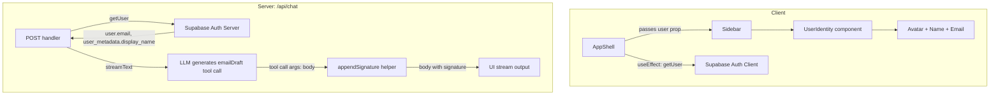

# Design Document: User Identity Display

## Overview

This feature adds two capabilities to the Harco agent:

1. **Sidebar identity display** — Shows the authenticated user's name and email in the sidebar footer, to the left of the existing sign-out button.
2. **Automatic email signature** — Programmatically appends a signature block to every email draft body on the server side, before the content reaches the UI stream. This ensures the signature flows through all output channels (card render, copy, mailto, Outlook) without requiring the LLM to generate it.

Both capabilities source their data from the existing Supabase Auth user record — no new database tables, API endpoints, or server round-trips are needed.

## Architecture



**Key design decisions:**

1. **Client-side user fetch in AppShell** — The `AppShell` component already lazily imports the Supabase client for sign-out. We add a `useEffect` that calls `supabase.auth.getUser()` once on mount and passes the result down to `Sidebar` as props. This avoids a server round-trip (the Supabase browser client reads from the existing session cookie).

2. **Server-side signature append** — The signature is injected into the `emailDraft` tool output body inside the streaming pipeline, after the LLM generates the tool call but before the result is written to the UI stream. This guarantees every channel (card, clipboard copy, mailto, Outlook payload) receives the same body with signature included. No client-side logic needed.

3. **Pure function for signature formatting** — The `appendSignature` helper is a pure function: `(body, displayName, email) => bodyWithSignature`. Easy to test, no side effects.

## Components and Interfaces

### UserIdentity Component

New component: `src/components/app-shell/user-identity.tsx`

```typescript
interface UserIdentityProps {
  displayName?: string | null;
  email?: string | null;
}
```

Renders inside the sidebar footer div. Shows:
- An avatar circle with user's initials (first letter of first name + first letter of last name, derived from `displayName`). Falls back to first letter of email if no displayName.
- `displayName` on the first line (standard text weight, truncated with ellipsis).
- `email` on the second line (smaller font, muted color, truncated with ellipsis).
- When `displayName` is absent: email only, single line.
- When neither is available: renders nothing (fragment).

### Sidebar Props Extension

```typescript
interface SidebarProps {
  open: boolean;
  onClose: () => void;
  onNewQuestion: () => void;
  onSignOut: () => void;
  userDisplayName?: string | null;  // new
  userEmail?: string | null;        // new
}
```

### appendSignature Helper

New module: `src/lib/email-signature.ts`

```typescript
export function appendSignature(
  body: string,
  displayName: string | null | undefined,
  email: string
): string;
```

Returns the body with a signature block appended. Format:

```
{body}

Best,
{displayName}
Harco Fittings
```

When `displayName` is null/undefined/empty string:

```
{body}

Best,
{email}
Harco Fittings
```

The separator between body and signature is always exactly `\n\n` (one blank line).

### Chat API Route Modification

In `src/app/api/chat/route.ts`, after the LLM stream completes and tool calls are collected, intercept any `emailDraft` tool call and rewrite its `body` argument with the signature appended. This happens by processing the tool calls result and using a custom stream writer approach — specifically, we override the emailDraft tool to use `execute` which appends the signature before the tool result is emitted.

Actually, the cleaner approach given the current architecture (tools without `execute`, using `writer.merge`): We switch the `emailDraft` tool definition to include an `execute` function that appends the signature to the body before returning the tool result. This way the tool result flowing into the stream already contains the signature.

## Data Models

No new database tables or stored data. All data sourced from the existing Supabase Auth user record:

| Field | Source | Used For |
|-------|--------|----------|
| `display_name` | `user.user_metadata.display_name` | Sidebar display, signature line, system prompt preamble |
| `email` | `user.email` | Sidebar display, signature fallback |

### Initials Derivation

```typescript
function getInitials(displayName?: string | null, email?: string | null): string {
  if (displayName) {
    const parts = displayName.trim().split(/\s+/);
    if (parts.length >= 2) return (parts[0][0] + parts[parts.length - 1][0]).toUpperCase();
    return parts[0][0].toUpperCase();
  }
  if (email) return email[0].toUpperCase();
  return "?";
}
```

## Correctness Properties

*A property is a characteristic or behavior that should hold true across all valid executions of a system — essentially, a formal statement about what the system should do. Properties serve as the bridge between human-readable specifications and machine-verifiable correctness guarantees.*

### Property 1: Signature append preserves body and produces correct format

*For any* non-empty email body string and any user identity (with or without display_name, with a valid email), the `appendSignature` function SHALL return a string that starts with the original body, followed by exactly "\n\n", followed by "Best,\n", followed by either the display_name (when non-empty) or the email, followed by "\nHarco Fittings".

**Validates: Requirements 2.1, 2.2, 2.3, 2.4**

### Property 2: Signature identification line matches identity data

*For any* user identity where display_name is a non-empty string, the signature block SHALL contain display_name as the identification line. *For any* user identity where display_name is null, undefined, or empty string, the signature block SHALL contain the email address as the identification line instead.

**Validates: Requirements 2.2, 2.3**

### Property 3: Initials derivation correctness

*For any* display_name consisting of two or more whitespace-separated words, `getInitials` SHALL return the uppercase first character of the first word concatenated with the uppercase first character of the last word. *For any* display_name consisting of a single word, it SHALL return the uppercase first character of that word.

**Validates: Requirements 1.2, 1.3**

## Error Handling

| Scenario | Behavior |
|----------|----------|
| Supabase `getUser()` returns null/error on client | `UserIdentity` receives no props, renders nothing. Sign-out button remains. |
| `display_name` is null/undefined/empty | Sidebar shows email only. Signature uses email as identification line. |
| `email` is null/undefined | `UserIdentity` renders nothing. Signature cannot be appended (email is required for auth, so this case should not occur in practice). |
| `emailDraft` tool not called | No signature logic executes. No side effects. |
| Body is empty string from LLM | Signature is still appended (produces just the signature block). |

## Testing Strategy

### Property-Based Tests

Library: **fast-check** (already available in the Node ecosystem, pairs with vitest)

Each property test runs minimum 100 iterations with randomly generated inputs.

- **Property 1 test**: Generate random body strings (including unicode, newlines, whitespace) and random identity pairs (displayName: string | null, email: valid email format). Assert the output matches the expected pattern.
- **Property 2 test**: Generate random identities with varying displayName values (null, empty, whitespace-only, valid names). Assert the correct identification line appears.
- **Property 3 test**: Generate random multi-word names and single-word names. Assert initials match expected derivation.

Tag format: `Feature: user-identity-display, Property {N}: {description}`

### Unit Tests (Example-Based)

- `UserIdentity` component renders name + email when both provided
- `UserIdentity` component renders email only when displayName absent
- `UserIdentity` component renders nothing when email absent
- `appendSignature` with known inputs produces expected output
- Sidebar footer layout places identity left of sign-out button (snapshot)
- System prompt does not contain signature generation instructions

### Integration Tests

- Chat API route: when emailDraft tool is called, response stream body contains signature
- Sidebar: mocked Supabase client returns user, identity displays correctly
